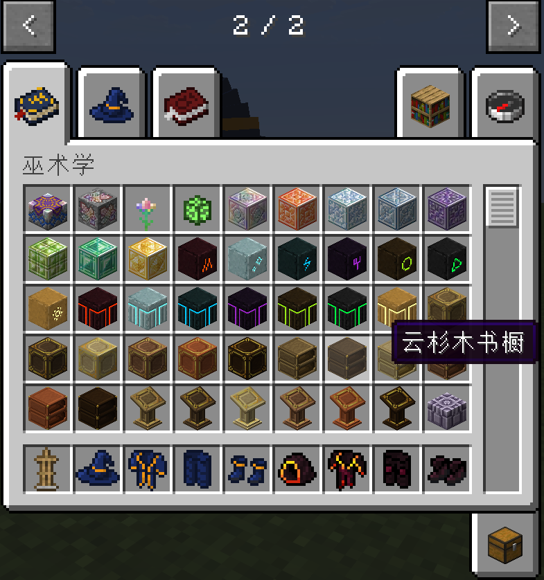
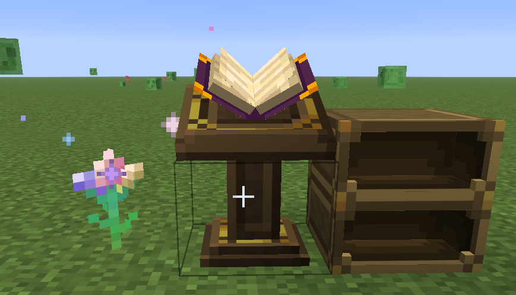
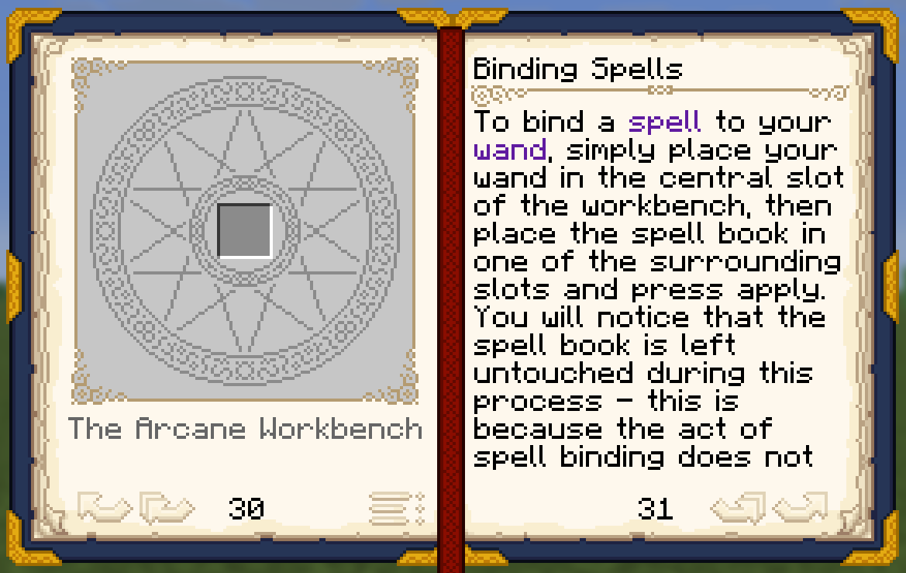
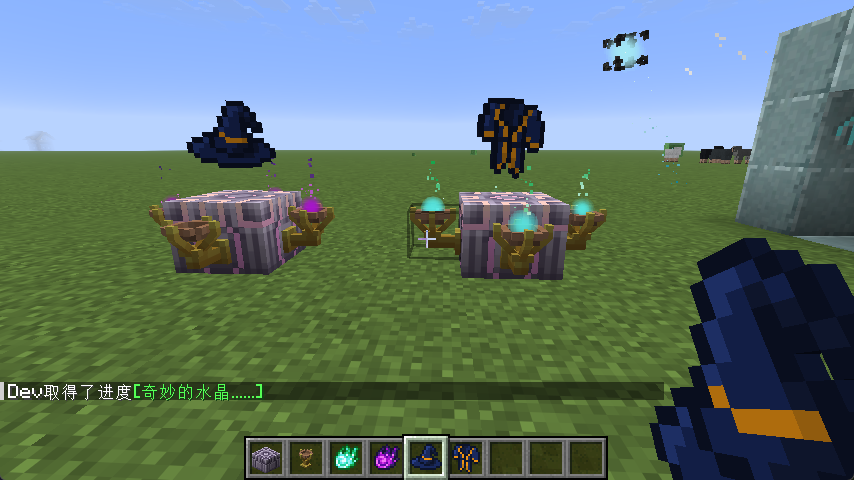

# Electroblob's Wizardry (NeoForge 26.2 移植版)

本项目是 **Electroblob's Wizardry** (原项目: [GitHub](https://github.com/Electroblob77/Wizardry)) 往现代 Minecraft
高版本（基于 **NeoForge 26.3** / Java 25 架构）的重构与移植尝试。

---

## 构建指南

请确保你的系统已安装以下工具，并将其二进制目录（`bin`）正确配置到系统的环境变量 `Path` 中：

* **Java 25 SDK** (推荐使用 GraalVM 或 Eclipse Temurin，并确保 `JAVA_HOME` 指向该版本)

> **验证环境**：配置完成后，打开终端（Terminal）或命令提示符（CMD）运行以下命令。若均能正常输出版本号，则说明环境就绪：
> ```bash
> java -version
> ```

### 2. 编译与构建步骤

项目采用 Gradle 进行依赖管理和混淆映射。请在项目根目录下执行以下脚本：

#### 编译并打包模组 (Build)

```bash
./gradlew build
```

### 3. 目前的工作进展
#### 基本完成的物品注册迁移

#### 基本完成的方块渲染迁移

#### 基本完成的巫术师手札迁移

#### 部分粒子效果迁移
